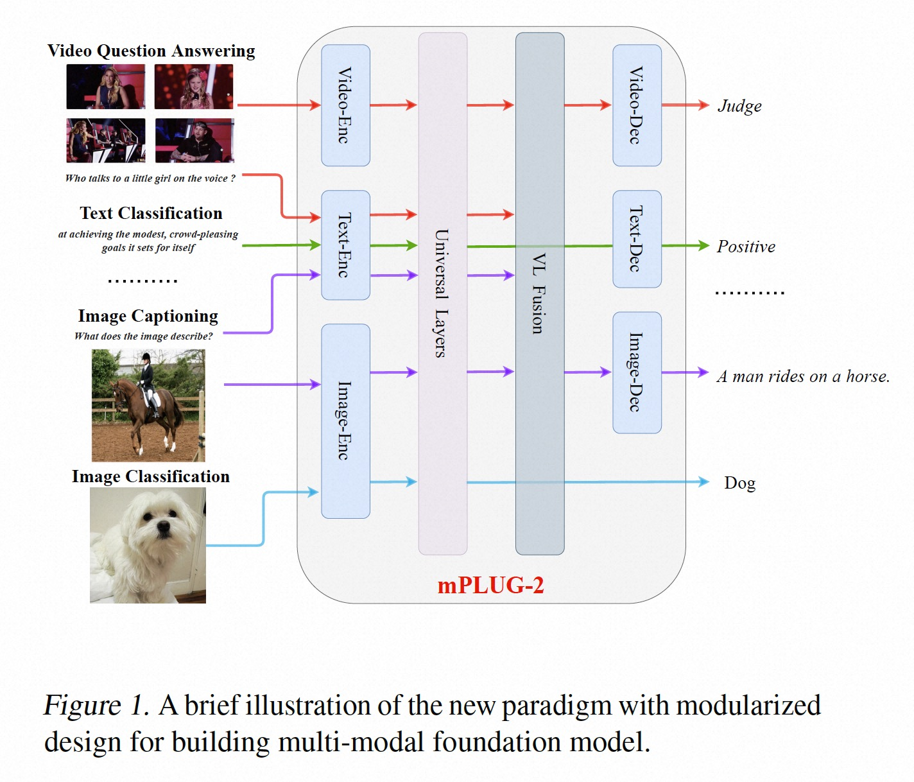
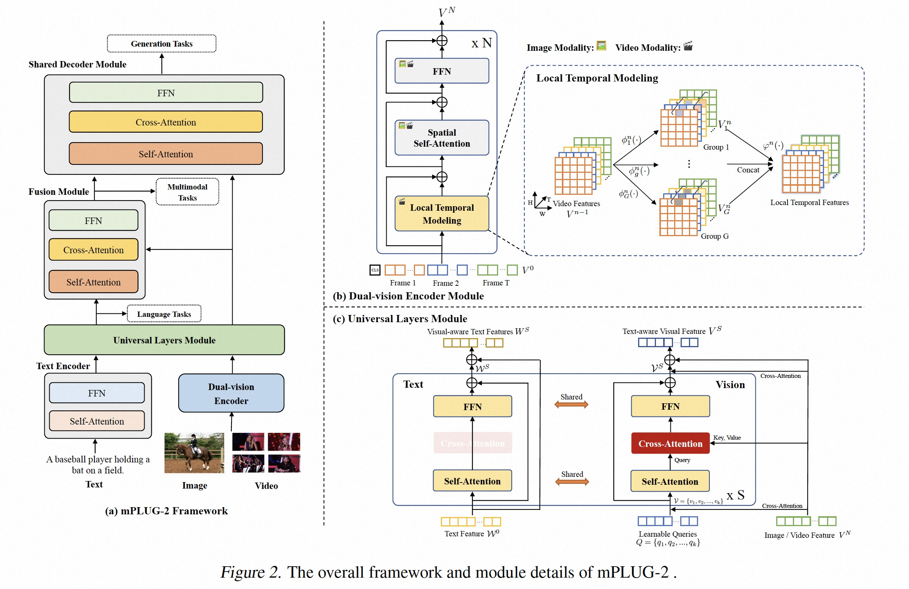

# mPLUG-2: A Modularized Multi-modal Foundation Model Across Text, Image and Video (ICML 2023)

[https://arxiv.org/abs/2302.00402](https://arxiv.org/abs/2302.00402)


## Introduction
we present mPLUG-2, a new unified paradigm with modularized design for multi-modal pretraining, which can benefit from modality collaboration while addressing the problem of modality entanglement. In contrast to predominant paradigms of solely relying on sequence-to-sequence generation or encoder-based instance discrimination, mPLUG-2 introduces a multi-module composition network by sharing common universal modules for modality collaboration and disentangling different modality modules to deal with modality entanglement. It is flexible to select different modules for different understanding and generation tasks across all modalities including text, image, and video. mPLUG-2 achieves state-of-the-art or competitive results on a broad range of over 30 downstream tasks, spanning multi-modal tasks of image-text and video-text understanding and generation, and uni-modal tasks of text-only, image-only, and video-only understanding.

<div align="center">

</div>

<div align="center">

</div>

## News

* 2023.07.21: Released mPLUG-2 pre-training model and downstream tasks!


## Models and Datasets

### Pre-trained Models

|Model | Visual Backbone | Text Enc Layers | Universal Layers | Fusion Layers | Text Dec Layers | #params | Download |
|------------------------|-------------------------------------------|------|------|------|------|-----|-----|
|mPLUG-2 | [ViT-L-14](https://alice-open.oss-cn-zhangjiakou.aliyuncs.com/mPLUG/ViT-L-14.tar) | 24 | 2 | 6 | 12 | 0.9B | [mPLUG-2](http://tjfd2.oss-cn-zhangjiakou.aliyuncs.com/mplug2/mPLUG2_Pretrain.pth) |
                                                                     

### Pre-train Datasets
                                                                        
| | COCO | VG | SBU | CC3M | CC13M | Webvid2M | WikiCorpus |
|------------------------|-------------------------------------------|------|------|------|------|------|-----|
|image | 113K | 100K | 860K | 3M | 10M | 2M | 20G |
|text | 567K | 769K | 860K | 3M | 10M | 2M | 350G | 


### Downstream Models

**VideoQA**

| Model | Dataset | Accuarcy | Download |
|------|---------|------|----------|
|mPLUG-2 | MSRVTT-QA | 48.0 | [mPLUG-2](http://tjfd2.oss-cn-zhangjiakou.aliyuncs.com/mplug2/mPLUG2_MSRVTT_QA.pth) |
|mPLUG-2 | MSVD-QA | 58.1 | [mPLUG-2](http://tjfd2.oss-cn-zhangjiakou.aliyuncs.com/mplug2/mPLUG2_MSVD_QA.pth) |

**Video Caption**

|Model | Dataset | CIDER | Download |
|-------------|----------------|------|------|
|mPLUG-2 | MSRVTT | 80.3 | [mPLUG-2](http://tjfd2.oss-cn-zhangjiakou.aliyuncs.com/mplug2/mPLUG2_MSRVTT_Caption.pth) |
|mPLUG-2 | MSVD | 165.8 | [mPLUG-2](http://tjfd2.oss-cn-zhangjiakou.aliyuncs.com/mplug2/mPLUG2_MSVD_Caption.pth) |


## Requirements
* [PyTorch](https://pytorch.org/) version >= 1.11.0

* Install other libraries via
```
pip install -r requirements.txt
```


## Pre-training

Comming soon.

## Fine-tuning
### Video Question Answering
1. Download MSRVTT-QA / MSVD-QA / TGIF datasets from the original websites.
2. In configs_video/VideoQA_msrvtt_large.yaml, set the paths for the json files and the video paths.
3. To perform evaluation, run：
<pre>sh scripts/inference_videoqa.sh</pre> 
4. To perform finetuning, run：
<pre>sh scripts/run_videoqa.sh</pre> 

###  Video Captioning
1. Download MSRVTT / MSVD datasets from the original websites.
2. In configs_video/VideoCaption_msrvtt_large.yaml, set the paths for the json files and the video paths.
3. To perform evaluation, run：
<pre>sh scripts/inference_videocaption.sh</pre> 
4. To perform finetuning, run：
<pre>sh scripts/run_videocaption.sh</pre> 


## Citation
If you found this work useful, consider giving this repository a star and citing our paper as followed:
```
@article{Xu2023mPLUG2AM,
  title={mPLUG-2: A Modularized Multi-modal Foundation Model Across Text, Image and Video},
  author={Haiyang Xu and Qinghao Ye and Ming Yan and Yaya Shi and Jiabo Ye and Yuanhong Xu and Chenliang Li and Bin Bi and Qi Qian and Wei Wang and Guohai Xu and Ji Zhang and Songfang Huang and Fei Huang and Jingren Zhou},
  journal={ArXiv},
  year={2023},
  volume={abs/2302.00402}
}
```

## Acknowledgement
The implementation of mPLUG relies on resources from [ALBEF](https://github.com/salesforce/ALBEF), [BLIP](https://github.com/salesforce/BLIP), and [timm](https://github.com/rwightman/pytorch-image-models/tree/master/timm). We thank the original authors for their open-sourcing.

